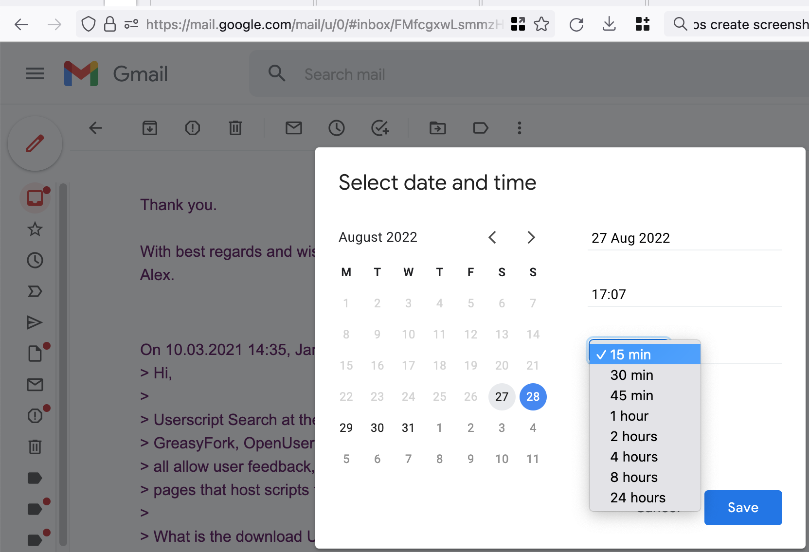
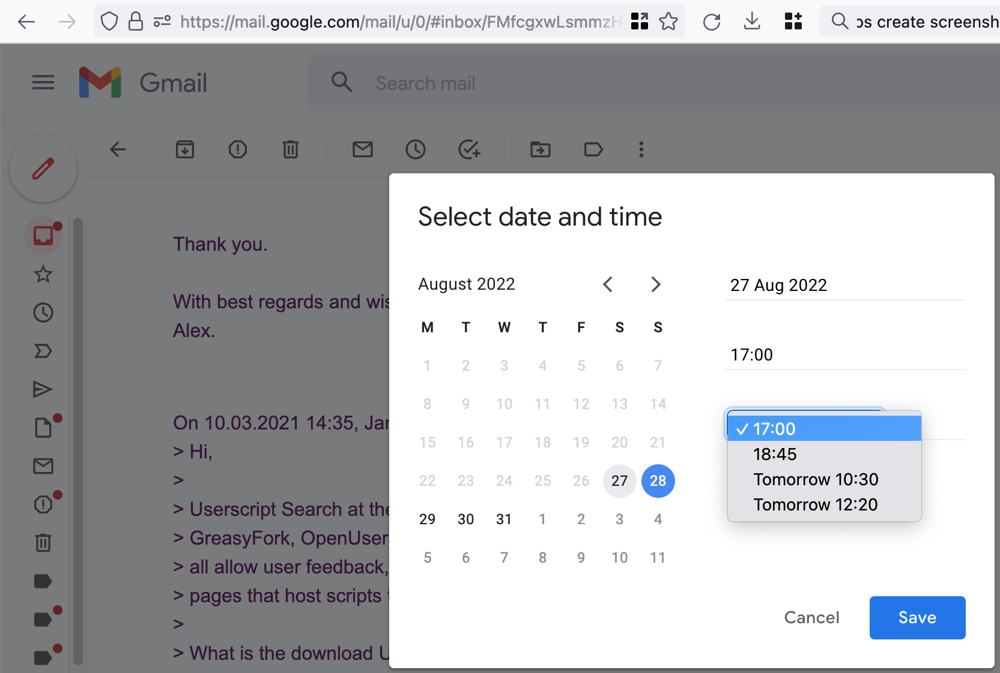

## Intro ##

The `GmailEnhancer.user.js` is designed to bring additional functionality and
UI enhancements to [Gmail](https://mail.google.com/). These include
enhancements for the `Snooze until...` dialog (choose how much to postpone the
task), mail font size tweaking, etc.

To install script click the following link -
[GmailEnhancer.user.js](https://github.com/achernyakevich/tmsp-gmailenhancer/raw/refs/heads/main/GmailEnhancer.user.js).

## Features

### Mail "Snooze until..." dialog enhancements

If you have open "Snooze until..." dialog then you can use the following
keyboard shortcuts:

* `Alt + B` (macOS - `Option + B`) - it will show selectbox to select relative
snooze options.

* `Ctrl + B` (macOS - `MacCtrl + B`) - it will show selectbox to select fixed time
snooze options.

### Gmail font size tweaking

For huge screens you could experience a problem of reading mail text because
of too small font size used. This script fix it by using bigger font as
default. It is available not only in mail reading pane but in mail writing
too (though mail will be sent using default Gmail styles).

As a side effect you could see in received mail interesting things like what
part of the text was copy-pasted and what was hand-typed. :)

### Other

See more in detailed [Release Notes](./ReleaseNotes.md).

## Contribution guidelines ##

If you would like to contribute - create a pull request.

If you have found a bug or need some features or would like to propose some
features - create an issue. But we will appreciate if you will first check
the list of [already existed issues](https://github.com/achernyakevich/tmsp-gmailenhancer/issues)
to prevent creation of duplicates.
